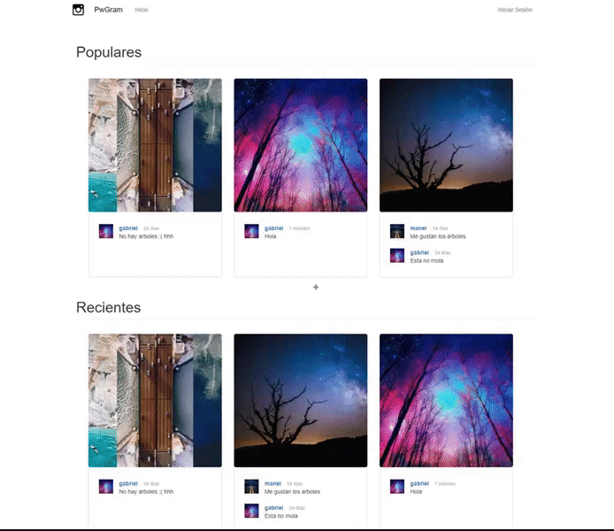

# Pwgram

This project is based on a Instagram style webpage, with the use of silex and MVC project structure. 
Still some bugs in the edit profile page, but mostly done.  

### Frontpage (No logged in)

### Frontpage (Logged in)

### Login

### Disconnect

### Register

### Menu

### Comments and likes

### Notification Page

### Comments Page

### Image Page

### Add new Image

### Profile Page

### OrderBy Profile Images

