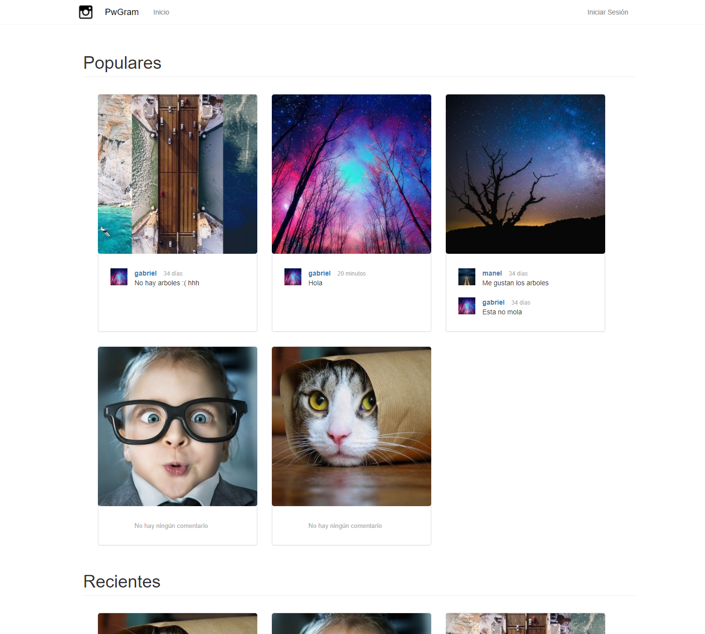

# Pwgram

This project is based on a Instagram style webpage, with the use of silex and MVC project structure. 
Still some bugs in the edit profile page, but mostly done.  
Keep in mind, this was developed to work with a SSL certificate, so no password encryption was done in client side to ensure data is sent securely. 

Here is some screenshots/gifs:

## Frontpage

The frontpage structure has two categories, populars and recent. Both are organized in a grid layout. The information of each image is hidden and only visible when the user moves the mouse over. 

### No logged in

----

### Logged in

----
### Animation on mouse hover

## Access
### Login
Both the login and register are treated in popups, so the user doesn't have to visit another page to do it. 

----
### Register
The profile image, just as we did in the new image page, we used Cropper.js, a JS library that gives an interface to crop images the way the user wants and in our case keep the aspect ratio of all images to 1:1. 

----
### Disconnect

Dialog popup before user disconects. Cookies are deleted too.

----

## Navigation Bar
Dropdown menus for both notifications and user options.

----
## Comments and likes

Both likes and comments are updated on the two categories at the same time and in the photo itself. 

----

## Pages
### Notifications

Users can sort the notifications by user, type, image and time. Once the user clicks on the "Visto" button on each notification, this disappears on both the table and the notification count in the NavBar.

----
### Comments

Just as the notifications page, this one lets users edit the comment and delete it. 

----
### Image

Each image holds the visits count. In this case, because we are the owners of the image, we can edit its title or privacy status and delete the image. 

Users are limited to one comment per image, in case of trying to add more than one it shows a message:

----
### New Image

Users can add images of any size. But because the scale of the images would have to be treated and cut in some way, we decided to add a JS library called Cropper. This give users an interface to cut the image the way they like and we mantain the aspect ration of 1:1 in all images.

----
### Profile

Simple profile page, all images are showed to the user including the private ones in case the profile you're looking is yours. 

The user can also order images by recent, more likes or more comments

